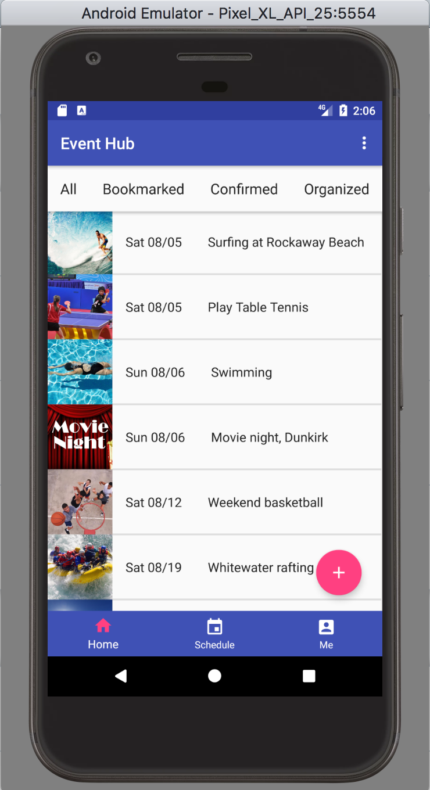
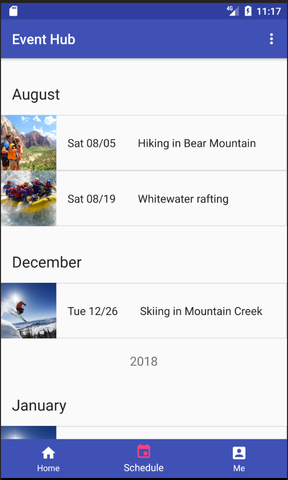
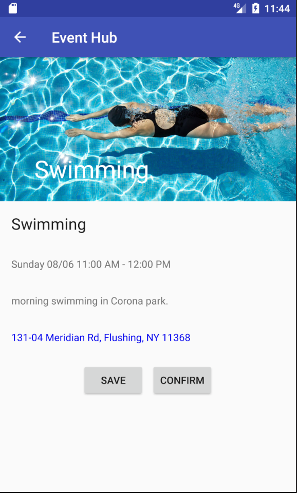
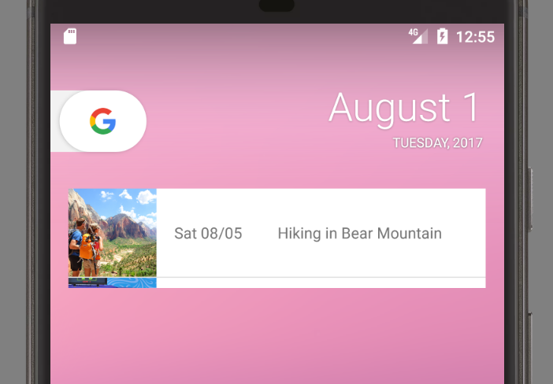

# Android Capstone Project

App helps user to manage all his social events. User can

* bookmark an event he's interested.
* confirm an event he's going.
* organized his own event.

Widget lists user's confirmed events.

# Requirements

[rubic](https://review.udacity.com/#!/rubrics/65/view)

**Core Platform Development**

* app validates signup form and new event form
* app provides a widget

**Google Play Services**

* App uses Google map to show event location.
* App uses Google location to show device current location.
* If address can be resolved, internal map shows event and user's location.
  If not resolved, app opens external Google map.
* App uses admob to show ads.

**Material Design**

* App bar layout and parallax scrolling are used in event detail activity.
* Transition is used between master detail activities.

**Data Persistence**

* App uses content provider to access custom [api](https://github.com/dorren/android_p6_api_server).
* App uses AsyncTask in many activities.

# Test

### Login
You can login with tester@gmail.com / testtest, or  any of the user from this [list](https://github.com/dorren/android_p6_api_server/blob/master/tasks/db_seed.json)
 , or you could just sign up too.

### Widget
* you can scroll the widget list.
* To test widget refresh button, in the app confirm a few events, then refresh the
 widget.

# Common errors
* check strings.xml, ensure correct api_url is used.
